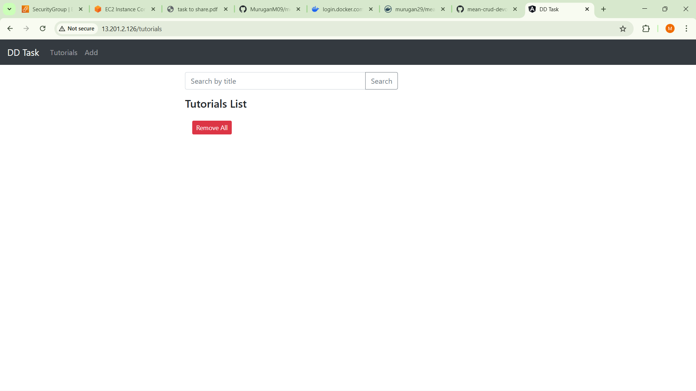
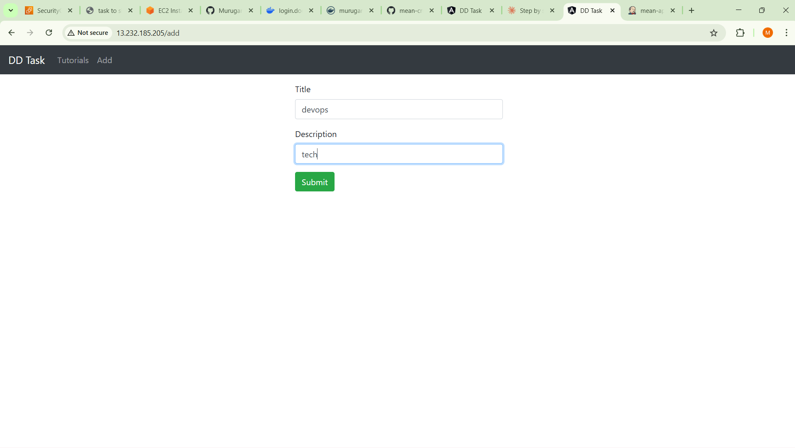
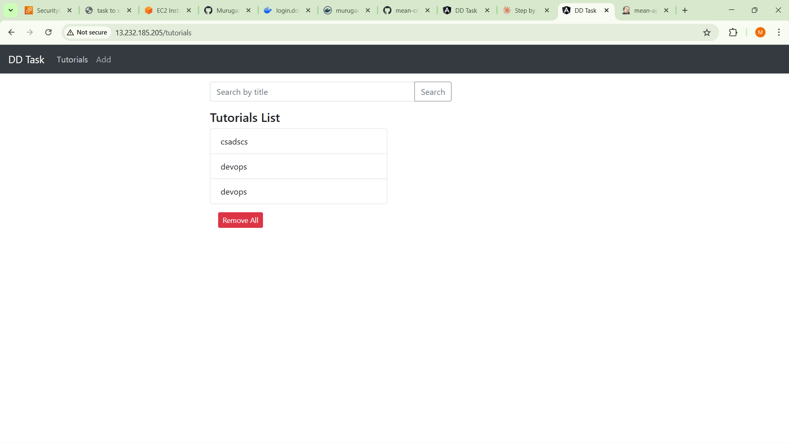
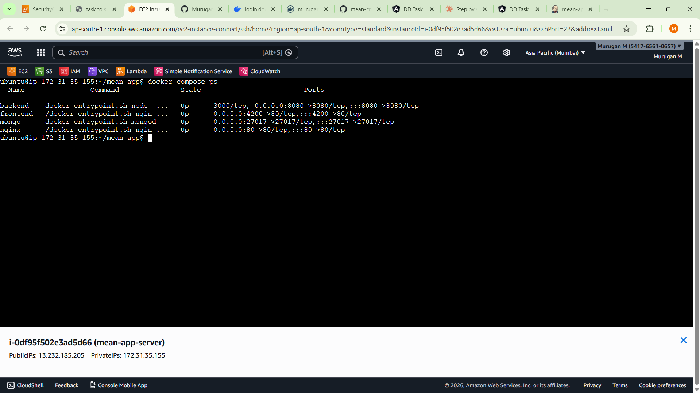
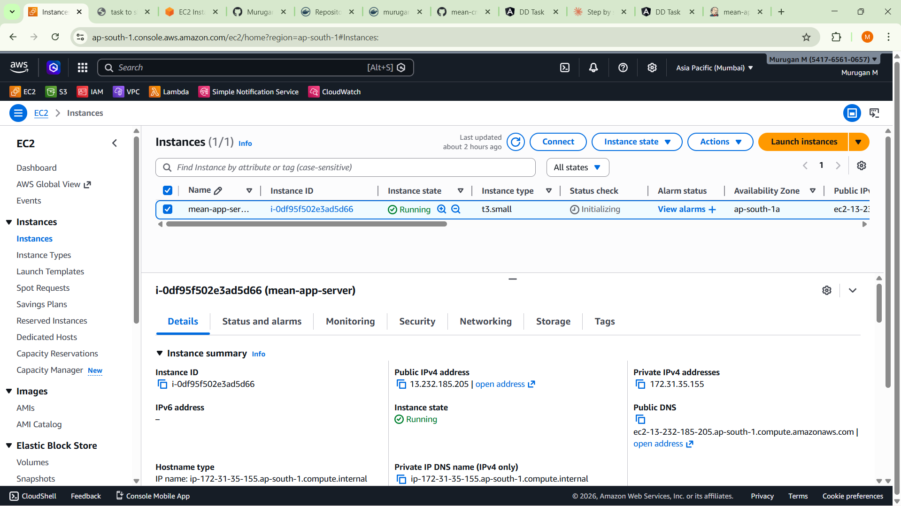
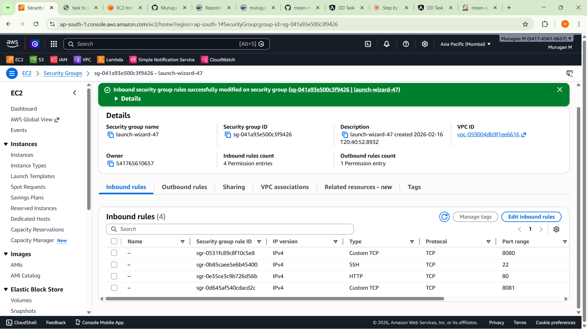
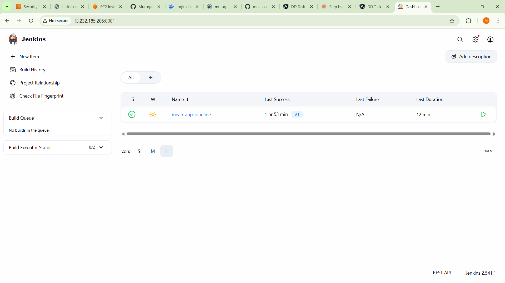
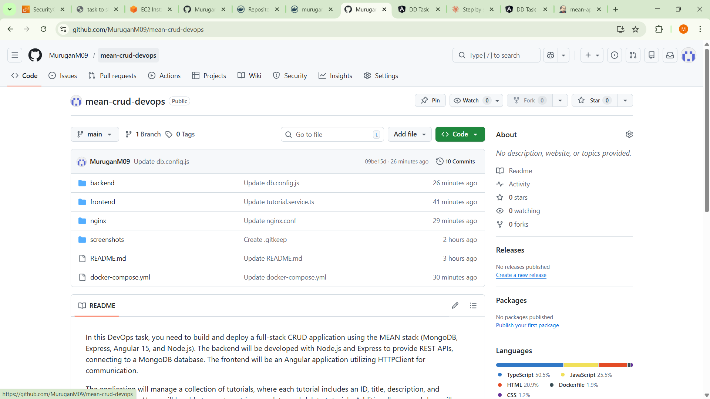

# 🚀 MEAN Stack CRUD Application — DevOps Deployment

<p align="center">


</p>

Full-stack **MEAN (MongoDB, Express, Angular, Node.js)** application deployed on **AWS EC2** using **Docker containerization**, **Nginx reverse proxy**, and **Jenkins CI/CD pipeline**.

---

# 🌐 Live Application

👉 **http://13.232.185.205**

---

# 🏗️ Architecture

```
Browser
   ↓
Nginx (Port 80)
   ├── Angular Frontend (Port 4200)
   └── Node.js Backend (Port 8080)
            ↓
         MongoDB (27017)
```

---

# 🛠️ Technology Stack

| Layer            | Technology              |
| ---------------- | ----------------------- |
| Frontend         | Angular 15              |
| Backend          | Node.js + Express       |
| Database         | MongoDB 6               |
| Containerization | Docker + Docker Compose |
| Cloud            | AWS EC2 Ubuntu 22.04    |
| Reverse Proxy    | Nginx                   |
| CI/CD            | Jenkins                 |
| Version Control  | GitHub                  |

---

# 📁 Project Structure

```
mean-crud-devops/
├── backend/
├── frontend/
├── nginx/
├── docker-compose.yml
└── screenshots/
```

---

# 🐋 Docker Configuration

## docker-compose.yml

Services running:

* MongoDB → `27017`
* Backend API → `8080`
* Angular Frontend → internal `80`
* Nginx Reverse Proxy → `80`

### Frontend Port Mapping

```yaml
frontend:
  ports:
    - "4200:80"
```

### Backend DB Connection

```yaml
environment:
  - MONGODB_URI=mongodb://mongo:27017/mean-crud
```

---

# 🚀 Deployment Steps

## 1️⃣ Clone Repository

```bash
git clone https://github.com/MuruganM09/mean-crud-devops.git
cd mean-crud-devops
```

## 2️⃣ Build Docker Images

```bash
cd backend
docker build -t murugan29/mean-backend:latest .
docker push murugan29/mean-backend:latest

cd ../frontend
docker build -t murugan29/mean-frontend:latest .
docker push murugan29/mean-frontend:latest
```

## 3️⃣ AWS EC2 Setup

* Instance: t2.micro
* OS: Ubuntu 22.04
* Ports: 22, 80, 8080, 8081

```bash
sudo apt update
sudo apt install -y docker.io docker-compose
sudo usermod -aG docker ubuntu
```

## 4️⃣ Deploy

```bash
docker-compose up -d
```

## 5️⃣ Verify

```bash
docker-compose ps
```

---

# 📸 Application Screenshots

## 🧾 Tutorials Homepage

<p align="center">

</p>

## ➕ Create Tutorial Form

<p align="center">

</p>

## 📋 Tutorials Management

<p align="center">

</p>

---

# ⚙️ Infrastructure & Deployment

## 🐳 Docker Containers

<p align="center">

</p>

## ☁️ AWS EC2 Instance

<p align="center">

</p>

## 🔐 Security Groups

<p align="center">

</p>

---

# 🔄 CI/CD Pipeline

## Jenkins Dashboard

<p align="center">

</p>

---

# 🧑‍💻 Source Repository

<p align="center">

</p>

---

# 🔧 Key Features

* ✅ Full CRUD Operations
* ✅ RESTful API Architecture
* ✅ Angular Responsive UI
* ✅ Dockerized Microservices
* ✅ Nginx Reverse Proxy
* ✅ MongoDB Persistent Storage
* ✅ AWS Cloud Deployment
* ✅ Jenkins CI/CD Automation

---

# 🌐 API Endpoints

```
GET    /api/tutorials
GET    /api/tutorials/:id
POST   /api/tutorials
PUT    /api/tutorials/:id
DELETE /api/tutorials/:id
DELETE /api/tutorials
```

---

# 🔐 Configuration

## Frontend API

```
frontend/src/app/services/tutorial.service.ts
```

```ts
const baseUrl = '/api/tutorials';
```

## Nginx Proxy

```
nginx/nginx.conf
```

* `/` → frontend
* `/api/` → backend

## Database

```
backend/app/config/db.config.js
```

```js
url: process.env.MONGODB_URI || "mongodb://mongo:27017/mean-crud"
```

---

# 🧰 Deployment Commands

```bash
docker-compose up -d
docker-compose down
docker-compose logs -f
docker-compose restart [service]
docker-compose pull
```

---

# 🐛 Troubleshooting

**MongoDB Connection Issue**

* Check MONGODB_URI
* Verify mongo container

**Frontend API Error**

* Use `/api/tutorials`
* Check nginx config

**Port Conflicts**

* 80 → Nginx
* 8080 → Backend
* 4200 → Frontend
* 8081 → Jenkins

---

# 👨‍💻 Author

**Murugan M**

GitHub: https://github.com/MuruganM09
Repository: https://github.com/MuruganM09/mean-crud-devops

---

# 📄 License

Educational DevOps Project

---

# 🎯 Project Highlights

* Full-stack containerized deployment
* Docker Compose orchestration
* AWS EC2 hosting
* Nginx reverse proxy architecture
* Jenkins CI/CD pipeline
* Production-style DevOps workflow

---

## ✅ Project Status: **Deployed & Running**

**Last Updated:** February 17, 2026
